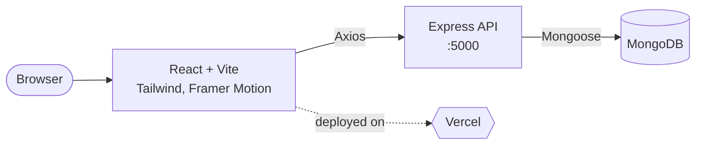

<div>

# ADG Website

**The home of Application Development Group, MIT Manipal.**
Built by students, for students. Fast, animated, and open to contributions.

[](https://adgmit.com)
[](./LICENSE)


</div>

---

## Why this exists

ADG is a student developer org and the website is its front door. It shows what we build, who we are and what is coming up next. It is also a real codebase that members can learn from and ship to, so it is kept open and beginner friendly on purpose.

## Tech stack

| Layer | Tools |
| --- | --- |
| Frontend | React 18, Vite, Tailwind CSS, Framer Motion, Axios |
| Backend | Node.js, Express.js |
| Database | MongoDB with Mongoose |
| Hosting | Vercel |

## How it fits together



## Project structure

```
adgmitwebsite/
├── frontend/              # React + Vite app
│   ├── src/
│   │   ├── components/    # UI sections (Header, Hero, About, Events, Contact, Footer)
│   │   ├── App.jsx        # Root component
│   │   ├── main.jsx       # Entry point
│   │   └── index.css      # Global styles
│   └── package.json
├── backend/               # Express API
│   ├── server.js
│   └── package.json
├── CONTRIBUTING.md
└── package.json           # Root scripts
```

## Getting started

### Prerequisites

- Node.js v18 or higher
- MongoDB (local install or a MongoDB Atlas cluster)
- npm or yarn

### 1. Clone and install

```bash
git clone https://github.com/appledevgroup/adgmitwebsite.git
cd adgmitwebsite
npm run install-all
```

Prefer doing it by hand?

```bash
npm install
cd frontend && npm install
cd ../backend && npm install
```

### 2. Set up environment variables

Create a `.env` file inside `backend/`:

```env
MONGODB_URI=your_mongodb_connection_string
PORT=5000
```

### 3. Run it

Split your terminal and run both servers:

```bash
# Terminal 1: backend
cd backend
node server.js

# Terminal 2: frontend
cd frontend
npm run dev
```

| Service | URL |
| --- | --- |
| Frontend | http://localhost:3000 |
| Backend | http://localhost:5000 |

## Customizing for your club

Forking this for your own org? Here is where things live.

<details>
<summary><b>Logo</b></summary>

Drop your logo at `frontend/public/logo.png`, then update `frontend/src/components/Header.jsx`:

```jsx

```

</details>

<details>
<summary><b>Club info</b></summary>

| What | Where |
| --- | --- |
| Club name | `Header.jsx`, `Hero.jsx`, `Footer.jsx` |
| Stats | `stats` array in `About.jsx` |
| Events | `events` array in `Events.jsx` |
| Contact info | `contactInfo` array in `Contact.jsx` |

</details>

<details>
<summary><b>Styling</b></summary>

Global styles live in `frontend/src/index.css`. Theme tweaks (colors, gradients, animations) go in `tailwind.config.js`.

</details>

## Contributing

We love new contributors, especially first timers. The short version:

1. Fork the repo and create a branch: `git checkout -b feat/your-feature`
2. Make your changes and keep commits focused
3. Run the app locally and make sure nothing breaks
4. Open a pull request with a clear description (screenshots help a lot for UI changes)

Read the full guide in [CONTRIBUTING.md](./CONTRIBUTING.md) before you start.

**Commit style**

```
feat: add events carousel
fix: board members card overflow on mobile
docs: update setup steps
```

## Contributors

Thanks to everyone who has helped build this.

<a href="https://github.com/appledevgroup/adgmitwebsite/graphs/contributors">
  
</a>

## Maintainer

Maintained by [@ADG MIT-M](https://github.com/appledevgroup)
